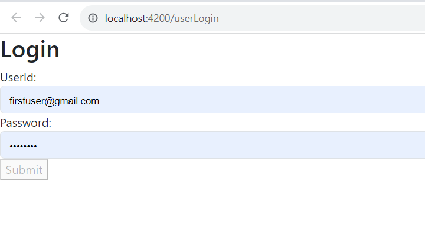

# BlogApplication

This project was generated with [Angular CLI](https://github.com/angular/angular-cli) version 16.2.0.

## Run Application

Install dependency by `npm install` command. Run `npm start` to start application. Navigate to `http://localhost:4200/`.

For now please use userId and Password as 'firstuser@gmail.com' & 'password'.

## Development server

Run `ng serve` for a dev server. Navigate to `http://localhost:4200/`. The application will automatically reload if you change any of the source files.

## Build

Run `ng build` to build the project. The build artifacts will be stored in the `dist/` directory.

## Further help

To get more help on the Angular CLI use `ng help` or go check out the [Angular CLI Overview and Command Reference](https://angular.io/cli) page.
